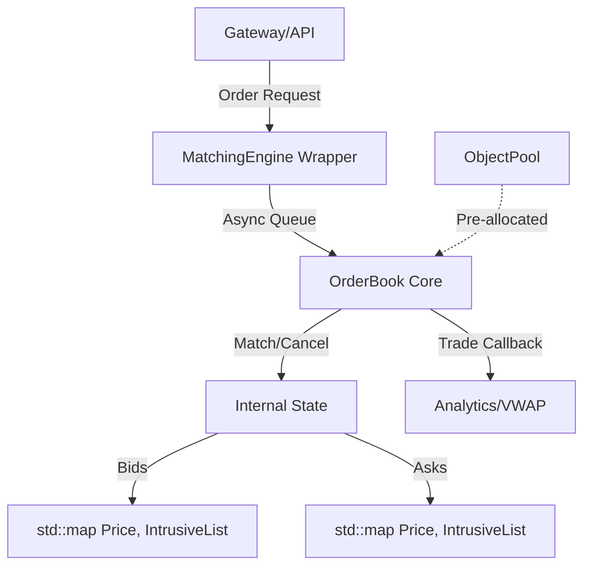

# HFT Order Matching Engine - Architecture & Design

## 1. System Overview



## 2. Core Components

### OrderBook Core
The `OrderBook` is the single-threaded owner of all resting orders. It provides O(1) order lookup by ID and O(1) matching for best price levels.

### IntrusiveList
A custom C++ template that manages `Order` nodes. By embedding the list pointers in the `Order` object, we eliminate the need for `std::list` wrappers and dynamic allocations.

```cpp
struct Order {
    OrderId id;
    // ...
    Order *next, *prev; // List pointers
};
```

### Self-Match Prevention (SMP)
Before any trade is executed, the engine checks the `ParticipantId` of both the maker and taker. If a match is detected, the taker order is immediately cancelled to prevent wash trading and preserve market integrity.

## 3. Data Flow

1.  **Ingress**: Order arrives via `addOrder`.
2.  **Validation**: Circuit Breaker and OTR checks.
3.  **Matching**: Engine checks if `Side::Buy @ Price >= BestAsk` or `Side::Sell @ Price <= BestBid`.
4.  **Execution**: `Trade` records generated and `TradeCallback` invoked.
5.  **Analytics**: VWAP, TWAP, and OTR stats updated.
6.  **Persistence**: If remaining qty > 0, order enters the book at its price level.
